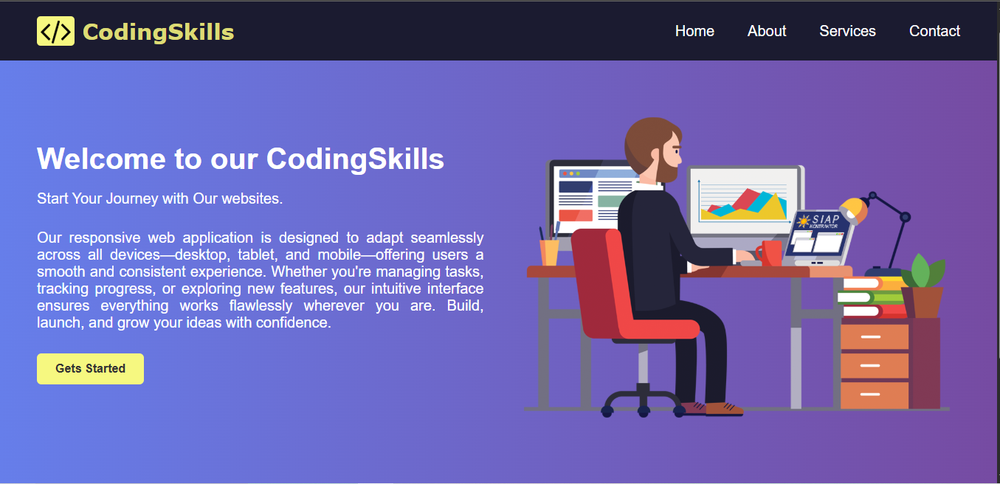
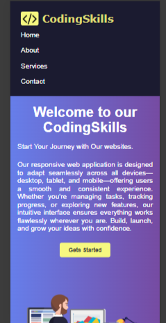
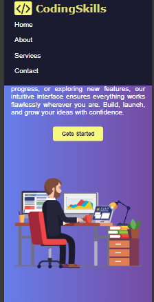

# Responsive Simple Website  🌐

This is a responsive landing page built with **HTML** and **CSS**. It features a beautiful gradient background, a sticky navigation bar, a modern hero section with text and image, and a clean footer with social icons. The layout is fully responsive for both desktop and mobile devices.

---

## 🔥 Features

- 🌈 Gradient background
- 📌 Sticky Navigation bar
- 💡 Responsive Hero Section with text and image
- 📱 Fully mobile-friendly layout
- ⚡ Smooth hover effects on links and buttons
- 🔗 Social media icons in the footer

---

## 🖼️ Screenshots

### 💻 Desktop View
#### Hero Section

### 📱 Mobile View
#### Navbar & Hero Section

---

### 📱 Mobile View
####  Hero Section 

#### Footer

---
This is a simple website given by Elevate Labs for Web Devevelopment Internship Program.
